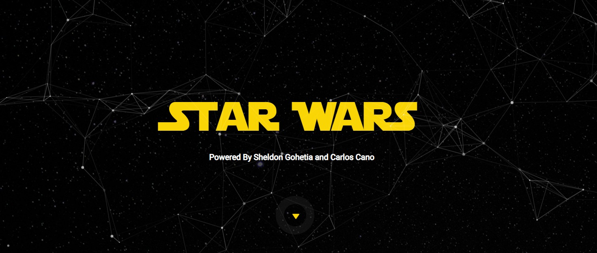

# Gohetia_Cano_AJAX-REDUX

This repo is for our HW#1 AJAX REDUX - which we create a Star Wars page integrated with the Start wars API (https://swapi.dev).

## Installation

1. Click on the link to the sample repository provided;
2. On the repo, click on the green button "< > Code";
3. On the last option, click on "Download zip";
4. Unzip the folder.

## Usage

1. Download the folder on your device;
2. Open the index.html file on the browser of your choice.

## History

None

## Credits

Sheldon Gohetia and Carlos Cano

## License

MIT licensed
